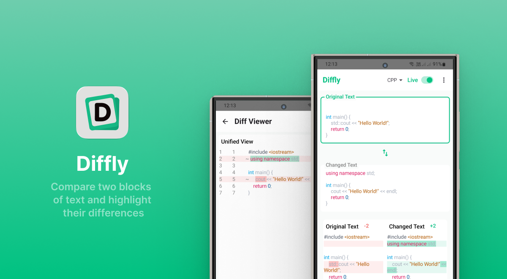
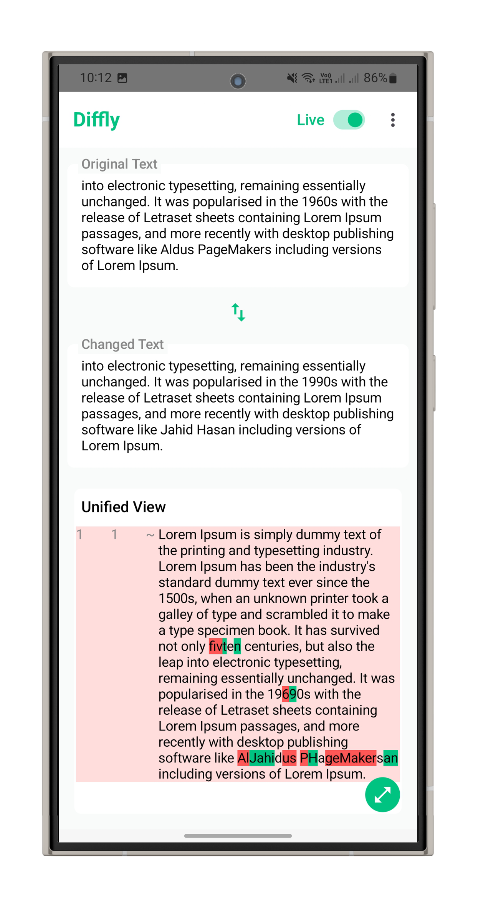
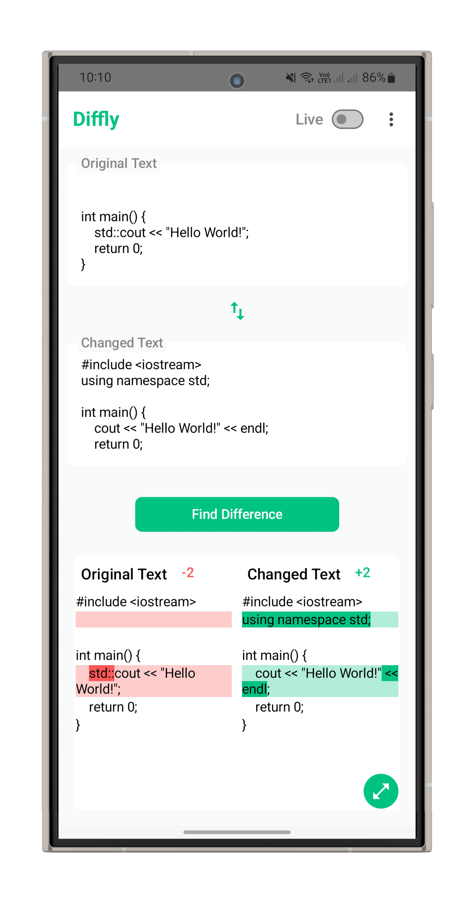
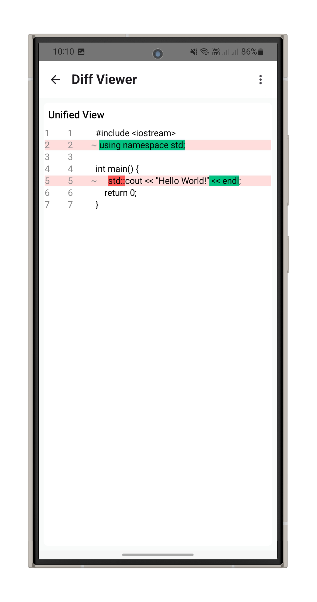
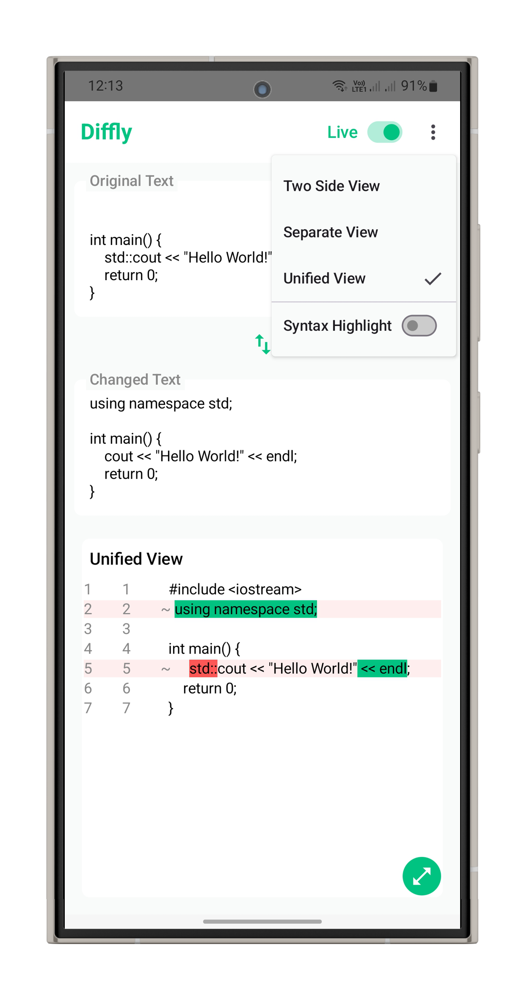
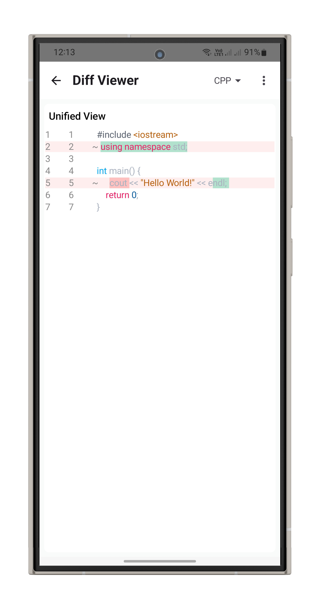
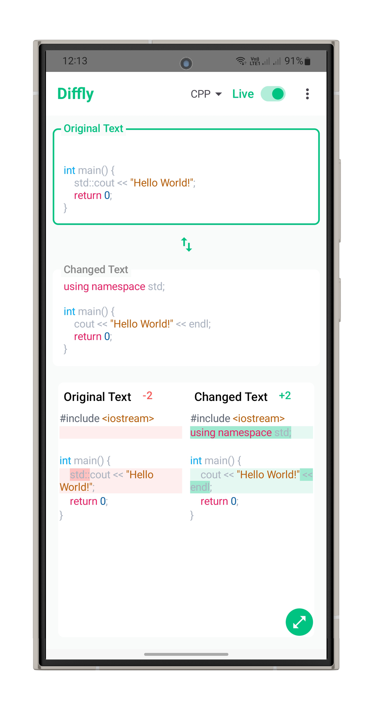

# Diffly



Diffly is a text comparison tool built in Kotlin, inspired by the functionality and user experience of [Diffchecker Text Compare](https://www.diffchecker.com/text-compare/). This project provides an easy-to-use interface for comparing two pieces of text and visualizing their differences efficiently.

## Features

- Compare two blocks of text and highlight their differences.
- Clean and user-friendly interface.
- Fast and accurate diffing algorithm.
- 100% Kotlin codebase.

## Inspiration

This project is inspired by [Diffchecker Text Compare](https://www.diffchecker.com/text-compare/), a popular web-based tool for comparing text files. Diffly seeks to provide similar capabilities in a standalone, open-source project.

## Screenshots

| Screenshot 1                           | Screenshot 2                           | Screenshot 3                           | Screenshot 4                           | Screenshot 5                           | Screenshot 6                           |
|----------------------------------------|----------------------------------------|----------------------------------------|----------------------------------------|----------------------------------------|----------------------------------------|
|  |  |  |  |  |  |

## Detect Algorithm

Diffly uses a diff detection algorithm to efficiently and accurately highlight differences between two text inputs. The algorithm typically works by:

1. **Splitting the input** into lines or words, depending on the granularity required.
2. **Comparing sequences** using a variation of the Longest Common Subsequence (LCS) algorithm. This helps to detect added, removed, and changed blocks in the input texts.
3. **Marking differences** by assigning segments as "added", "removed", or "unchanged", which are then highlighted accordingly in the UI.

While the core approach is inspired by standard diff algorithms, the implementation in Kotlin is optimized for performance and readability. This ensures that even large texts can be compared swiftly and results are easy to interpret.

## Getting Started

1. **Clone the repository:**
    ```bash
    git clone https://github.com/JahidHasanCO/diffly.git
    ```

2. **Open with your preferred Kotlin IDE (e.g., IntelliJ IDEA).**

3. **Build & Run:**
    - Follow the standard Kotlin project setup for your environment.
    - Run the main application file as defined in the source code.

## Contributing

Contributions are welcome! Please fork the repository and submit pull requests for any enhancements or bug fixes.

## License

This project is licensed under the MIT License.

---

**Note:** This project is not affiliated with Diffchecker; it is an open-source, independent reimplementation inspired by their public text comparison tool.